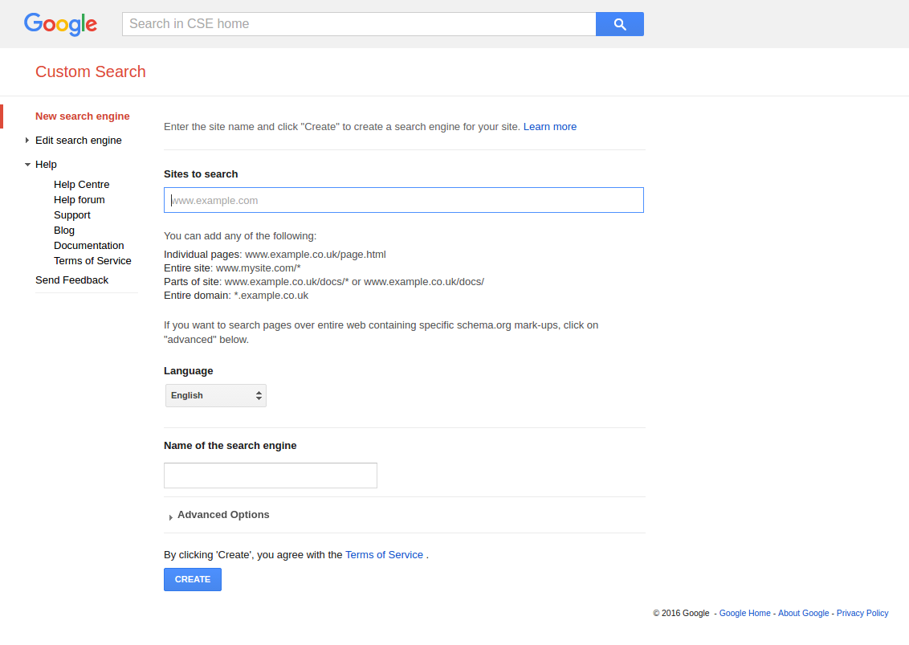
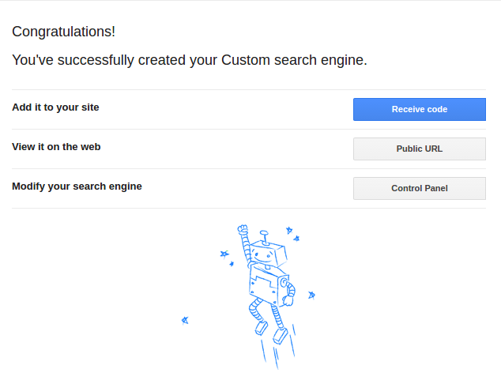
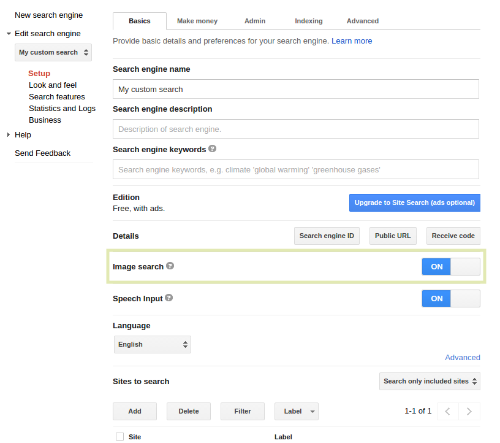

.. ==================================================
.. FOR YOUR INFORMATION
.. --------------------------------------------------
.. -*- coding: utf-8 -*- with BOM.

.. include:: ../Includes.txt

.. _admin-manual:

Administrator Manual
====================

And here we are. At the administrator manual, where the plot thickens.

As I indicated once, you defenitly need a google account to operate a Google custom search engine.With your google account visit `Google CSE official page <https://cse.google.co.in>`_

Here you'll see 'New Search Engine' option at top left side. By clicking this you'll get a wizard to configure a custom search engine. Inside the text box 'sites to search', enter your domain or site for which you are building CSE.

Once you entered the initial data, you'll get a success message from where you can navigate to your Google CSE control panel.

CSE control panel presents you a wide range of options to configure your CSE. From the side of an administrator, this preperations are enough.

* Collect your API key.
* Give it to your editor/TYPO3 Mascot
* Configure it and use at your own leisure

Believe me.. For an administrator, CSE control panel is totally cool.They have many customisable options for you.

Enabling Image Search
^^^^^^^^^^^^^^^^^^^^^

In the main dashboard of CSE control panel you can see the enable image search option.

	Control panel dashboard

If you ever intend to allow images to be displayed in your search engine keep enable image search option option 'ON' in the control panel.

    A great opera house isn't run by a director, but by a great administrator.