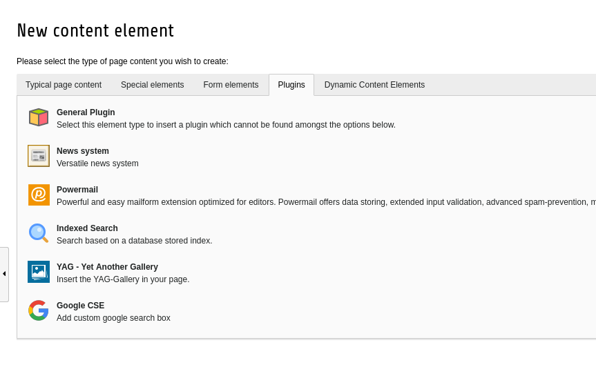
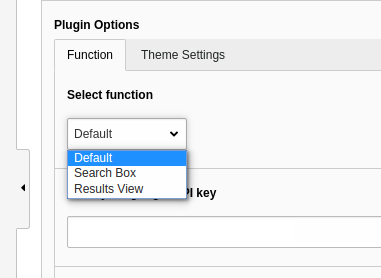
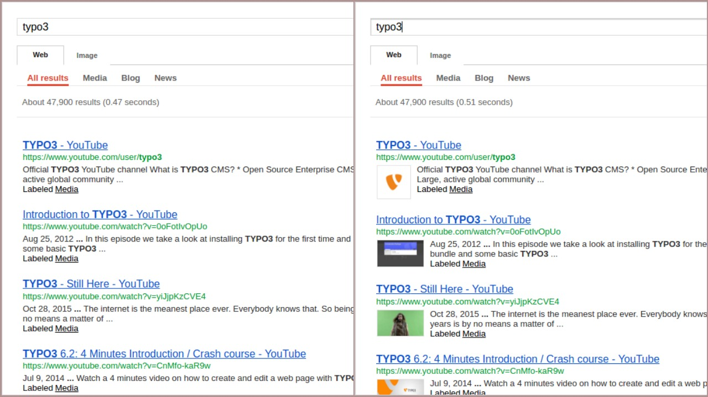
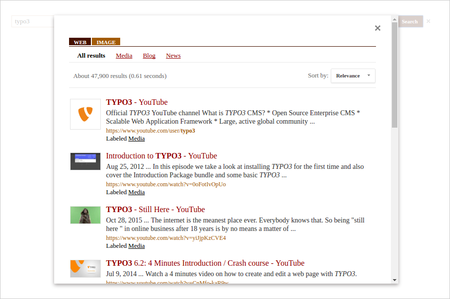

.. ==================================================
.. FOR YOUR INFORMATION
.. --------------------------------------------------
.. -*- coding: utf-8 -*- with BOM.

.. include:: ../Includes.txt

.. _users-manual:

Users manual
============

If you are all set for using the extension, relax, take a deep breath and read below section.

Install it like any other TYPO3 extension you use daily.

To add it as a content in the page, just insert a new content and go to plugin section and find google cse content there.

	Content add wizard

The extension presents you some plugin options, where some of them are mandatory with which you can't get the desired output and some of them are optional.

Select Function
^^^^^^^^^^^^^^^

In this plugin, it have three major functions

1) Default -> A view with both search box and results view

2) Search Box -> A view with only search box where result must be rendered seperately

3) Results View -> A view with only results view, depending to 2nd option

	Major functions

Enter your google API key
^^^^^^^^^^^^^^^^^^^^^^^^^

This section is really mandatory. Don't even think about leaving this field untouched.
Every user needs a google API key to work around with any google APIs. You can register your site with google API for a key. If you really want to know what's an API key, please refer `here <https://en.wikipedia.org/wiki/Google_APIs>`_

Choose an interface language
^^^^^^^^^^^^^^^^^^^^^^^^^^^^

Google custom search engine provides a set of interface languages for your engine. I hope I've managed every language they provide, into the extension to be picked by the user.If you don't bother to pick one, then english will be the default one.

Enable auto-complete
^^^^^^^^^^^^^^^^^^^^

Suggestions/auto-completion do make the searching more interactive, right ?? By enabling this option the user can throw some suggestions relating to the queries visitors make.

Enable imagesearch (The option must be set ON in CSE control panel)
^^^^^^^^^^^^^^^^^^^^^^^^^^^^^^^^^^^^^^^^^^^^^^^^^^^^^^^^^^^^^^^^^^^

By enabling image search, a visitor can also see what he/she is really sniffing into.

But sadly, to make this option available one have to enable image search in the dash board of your custom search engine. Confused ? Chill.. I'm explaining it briefly in the administrator's manual section. If you are an editor, please approach your site admin/TYPO3 admin or if you are on your own take time to glance into the administrator's manual.

In the second panel called 'Theme settings' you can manage interface of your search engine. There are seven glorious themes to pick.

Feel free.

Thumbnails in search results
^^^^^^^^^^^^^^^^^^^^^^^^^^^^

	Without thumbs : With thumbs

If there are any thumbnails available in the search result then enabling this option will permit it's view in frontend.If disabled, then simply links will be the search results.

Display search results in an overlay
^^^^^^^^^^^^^^^^^^^^^^^^^^^^^^^^^^^^

I say, overlay is an attractive way to print search results. Enable this option and see the changes.

	Overlay results view

NB : Both the default function & search box option do have these above explained plugin options while the results view looks deserted without any of these. No worries.. The results view is designed to work in accordance with search box function.

    So.. Happy Configuring!